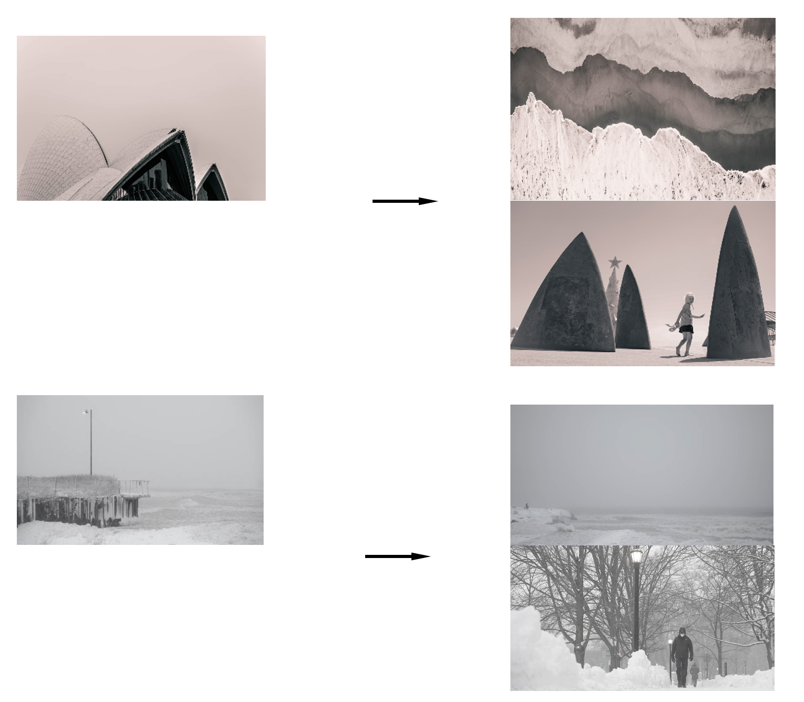

# Find Photos with Similar Style: A MLT Recommendation System Augmenting Photographers' Websites

**Author:** Hao Xu

**QA:** Junpeng (Marshall) Jiang


<!-- toc -->
- [Project Charter](#project-charter)
- [Directory Structure](#directory-structure)
- [Running the App](#running-the-app)
  * [0. Configurations](#0-configurations)
  * [1. Build Docker Image](#1-build-docker-image)
  * [2. Upload/Download raw dataset to/from S3 bucket](#2-uploaddownload-raw-dataset-tofrom-s3-bucket)
  * [3. Featurize the raw images](#3-featurize-the-raw-images)  
  * [4. Offline Model Tuning](#4-offline-model-tuning)
  * [5. Create DB](#5-create-db)
  * [6. Inject Data to DB](#6-inject-data-to-db)
  * [7. Move Images to App Serving Static Folder](#7-move-images-to-app-serving-static-folder)  
  * [8. Run App](#8-run-app)
  * [9. Other Notes](#9-other-notes)
    
  
<!-- tocstop -->

## Project Charter

#### Background 
It's always a good practice in the photography community to frequently browse others' works to get inspiration and new ideas. Some common destinations for photo galleries include [Adobe Stock](https://stock.adobe.com/), [500px.com](https://500px.com/), [Pinterest](https://www.pinterest.com/) etc. Besides, for customization, most professional photographers also build their personal websites to showcase their works and share ideas. However, without proper labeling, photographers sometimes find it harder to quickly find photos in a certain style from such a huge volume of available sources.

#### Vision
To make the photos better organized and easier to find, big platforms like 500px.com always enable users to tag their pictures with meaningful labels so they can make recommendations based on similarities. However, users aren't obligated to tag their uploads properly, and the labels are not always accurate. On top of that, it's is even harder for photographers who build their own websites to create and deploy recommendation systems to engage their visitors. 

This app is designed to solve the problem by building unsupervised learning models to automatically process all the photos and cluster them into meaningful groups. By doing this, photo gallery websites become capable of finding photos in similar styles without manually labeling them. 

#### Mission
The user will upload a photo (or select an existing photo), and the recommender will output a list of the most similar photos available on the website database leveraging clustering algorithms. The photos that will be used for this project are from my own website: https://elementarydeduction.com/ (Features representing the style of the photos will be generated using RGB meta data, potentially leveraging rule based feature generator and DL transfer learning.)

Example: 
If a user pick the picture on the left, the system should be able to recommend similar other pictures on the right.



#### Success Criteria

##### Machine Learning Metrics

The app will be using unsupervised learning algorithms. As a result, the metrics will be relatively subjective. We will be using clustering evaluation metrics to determine optimal cluster numbers and test the stability of the clustering results. 

Metrics:
- Silhouette score
- Within-cluster sum of square 

After the app goes live, we will be using AB tests to measure the effectiveness of the recommendations. Also, with user clicks recorded, we can then calculate recommender evaluation metrics

AB testing metrics:
- Click-through rate
- Click through possibility

Recommendation evaluation metircs:
- MAE / RMSE
- Precision / Recall / ROC
- mRR 
- nDCG

##### Business Metrics
To measure the business impact, we can perform AB testing on two versions of the websites, one with the recommender deployed and one without. We can then compare the user engagement level, which can be measured by average time spent, number of pictures clicked etc.

<br />

## Directory Structure

```
├── README.md                         <- You are here
├── app
│   ├── static/                       <- CSS, JS, image files that remain static
│   ├── templates/                    <- HTML (or other code) that is templated and changes based on a set of inputs
│   ├── boot.sh                       <- Start up script for launching app in Docker container.
│   ├── Dockerfile                    <- Dockerfile for building image to run app  
│
├── config                            <- Directory for configuration files 
│   ├── local/                        <- Directory for keeping environment variables and other local configurations that *do not sync** to Github 
│   ├── logging/                      <- Configuration of python loggers
│   ├── flaskconfig.py                <- Configurations for Flask API 
│   ├── model_config.yaml             <- Configurations for Model Pipeline
│
├── data                              <- Folder that contains data used or generated. Only the external/ and sample/ subdirectories are tracked by git. 
│   ├── model_data/                   <- Save the featurized data for model training
│   ├── raw_images/                   <- Raw image data
│
├── deliverables/                     <- Any white papers, presentations, final work products that are presented or delivered to a stakeholder 
│
├── figures/                          <- Generated graphics and figures to be used in reporting, documentation, etc
│
├── plots/                            <- Generated graphics and figures to be used in model tuning
│
├── models/                           <- Trained model objects (TMOs), model predictions, and/or model summaries
│
├── src/                              <- Source data for the project 
│
├── test/                             <- Files necessary for running model tests (see documentation below) 
│
├── app.py                            <- Flask wrapper for running the model 
├── run.py                            <- Simplifies the execution of one or more of the src scripts  
├── Dockerfile                        <- Dockerfile for model pipeline
├── Makefile                          <- Makefile to control the pipeline
├── requirements.txt                  <- Python package dependencies 
├── README.md                         <- MD file
```

<br />

## Running the App
### 0. Configurations

#### 0.1 Add Configuration for AWS S3 bucket 
This is used to access S3 bucket for raw image data, you can skip this id you have data locally and plan to deploy the app locally.


Configure environment variable to store your AWS access_key_id and secret_access_key:

```
export AWS_ACCESS_KEY_ID=<Your Access Key ID>

export AWS_SECRET_ACCESS_KEY=<Your Secret Key ID>
```

#### 0.2 Setup environmental variables for database connection:
Configuration for model serving data DB.

#### 0.2.1 RDS variables: 
This is used to access AWS RDS database, you can skip this if you plan to deploy the app locally.

```
export MYSQL_USER=<Your RDS Username>
export MYSQL_PASSWORD=<Your RDS Password>
export MYSQL_PORT=3306
export DATABASE_NAME=msia_423_DB
export MYSQL_HOST=msia-423-hxq9433.cy33ytpnmyxx.us-east-2.rds.amazonaws.com
```
#### 0.2.2 Local DB variables: 
By default, if neither environment variable `MYSQL_HOST` nor environment variable `SQLALCHEMY_DATABASE_URI` is not provided, a local sqlite database will be created at `sqlite:///data/photos.db`.  
(You can specify your own engine_string by providing environment variable `SQLALCHEMY_DATABASE_URI`.)

```
export SQLALCHEMY_DATABASE_URI=<Customized Engine String>
```

#### 0.3 Configure `config/logging/local.conf`, `model_config.yaml`  and `flaskconfig.py`

`config/logging/local.conf`: Local logger customization
`model_config.yaml`: Model pipeline configuration
`flaskconfig.py`: Web app configuration

#### 0.4 Configure `Makefile`
Config the Makefile to control the whole pipeline

#### 0.5 Connect to Northwestern University VPN
Only applicable for using the msia-423 deployment as RDS was set to only accessible by NU VPN users.

<br />

### 1. Build docker image
```
make image
```
<br />

### 2. Upload/Download raw dataset to/from S3 bucket

#### 2.1 Upload Raw Data to S3 
The following command will upload raw images to s3 according to the configurations in `Makefile`.
This is only needed if you have offline pictures that you want to upload to s3.)

```
make upload_to_s3
```

#### 2.2 Download Raw Data from S3 (only needed if your pictures are saved on s3)
The following command will download raw images from s3 according to the configurations in `Makefile`.
This is only needed if you have s3 pictures that you want to download to local. For this project I saved all the raw images on s3 bucket,so download is needed for pipeline. 
The following command will download the images to data folder for offline model tuning. 
```
make download_from_s3
```

<br />

### 3. Featurize the raw images
Parse the raw images and generate object and style features. 
(Style featurizing will take a long time which is normal.)
```
make featurize
```
<br />

### 4. Offline Model Tuning 
You can change the configurations in `model_config.yaml` and run the cluster model to check results.
Iterate through different configurations to find the best clustering solution.

#### 4.1 Run Model and Get Silhouette Chart 
The following command will generate silhouette chart for the given configuration.
```
make tune_model
```

#### 4.2 Run Model and Get Cluster Result 
The following command will generate cluster results for the given configuration.
```
make run_model
```

#### 4.3 Run Optimal Model and Get Cluster Results
The following command will generate cluster dataset using the optimal configuration defined in `model_config.yaml`.
```
make get_cluster
```
<br />

### 5. Create DB 

#### 5.1 Create DB Locally
```
make create_db_engine_string
```

#### 5.2. Create DB in RDS
```
make create_db_rds
```
<br />

### 6. Inject Data to DB
Inject style features table, object features table and cluster result table.
#### 6.1 Inject into Local DB
```
make inject_data_engine_string
```
#### 6.2 Inject into RDS
```
make inject_data_rds
```
<br />

### 7. Move Images to App Serving Static Folder
```
make remove_outdated_app_serving_images
```
```
make move_raw_images_to_static
```

<br />

### 8. Run App 

#### 8.1 Run Locally

#### 8.1.1 Run Locally on Local DB
```
make run_app_engine_string
```

#### 8.1.2 Run Locally on RDS
```
make run_app_rds
```
You can access the app via http://0.0.0.0:5000/.

#### 8.2 Run on AWS ECS
You can deploy the app to ECS using the Dockerfile in app folder.

<br />


### 9. Other Notes
#### 9.1 Run Unit Test
Unit test for important functions.
```
make tests
```

#### 9.2 Clean Up the Repo
Clean containers, images.
```
make stop_containers
```
```
make clean_docker
```


